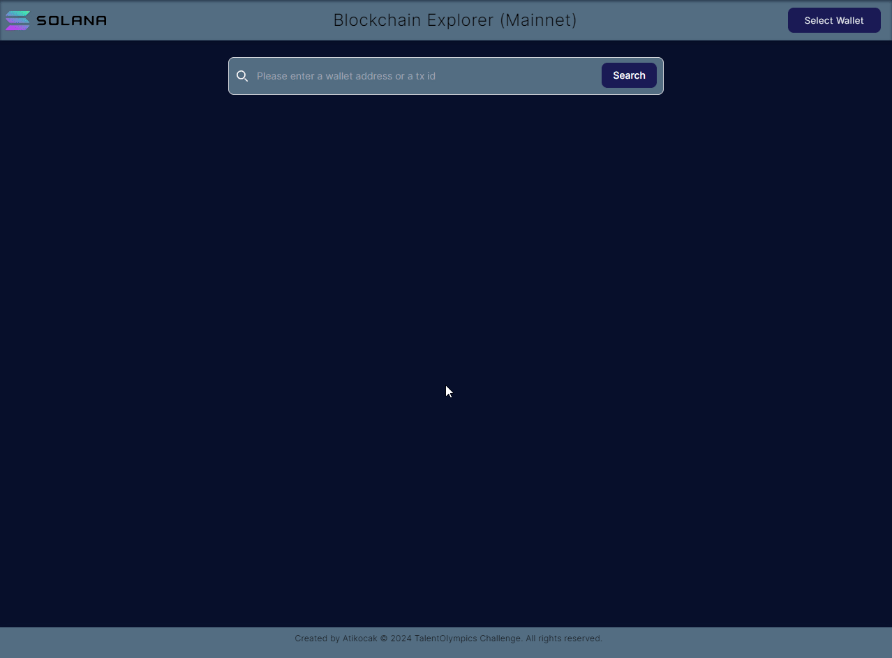

# Solana Blockchain Explorer



## Overview

This Solana Blockchain Explorer is a web application developed for the TalentOlympics challenge. It allows users to explore the Solana blockchain by searching for wallet addresses or transaction IDs, providing detailed information about transactions and account balances.

## Features

- Search for wallet addresses or transaction IDs
- Display account balance for wallet addresses
- Show the last 10 transactions for a given wallet address
- Provide detailed information for specific transactions
- Connect to user's own wallet to quickly view their transaction history
- Responsive design for various screen sizes

## Technologies Used

- React
- TypeScript
- Vite
- TailwindCSS
- Shadcn UI
- Solana Web3.js
- Alchemy RPC endpoints

## Prerequisites

Before you begin, ensure you have the following installed:

- Node.js (version 14 or later)
- Yarn package manager

## Installation

1. Clone the repository:

```
git clone https://github.com/your-username/solana-blockchain-explorer.git
```

2. Navigate to the project directory:

```
cd solana-blockchain-explorer
```

3. Install dependencies:

```
yarn install
```

4. Create a `.env.local` file in the root directory and add your Alchemy API key:

```
VITE_ALCHEMY_API_KEY=your_alchemy_api_key_here
```

## Running the Application

To start the development server:

```
yarn dev
```

The application will be available at `http://localhost:5173` (or another port if 5173 is in use).

## Building for Production

To create a production build:

```
yarn build
```

The built files will be in the `dist` directory.

## Deployment

This application can be deployed on platforms like Vercel or Cloudflare Pages. Follow the platform-specific instructions for deploying a Vite React application.

## Usage

1. On the home page, enter a Solana wallet address or transaction ID in the search bar.
2. For wallet addresses:
   - View the account balance
   - See the last 10 transactions associated with the address
3. For transaction IDs:
   - View detailed information about the specific transaction
4. Connect your own Solana wallet to quickly view your transaction history

## Project Structure

- `src/`: Source files
  - `components/`: React components
  - `layout/`: Layout components (Header, Footer, etc.)
  - `interfaces/`: TypeScript interfaces
- `public/`: Public assets
- `vite.config.ts`: Vite configuration
- `tailwind.config.js`: Tailwind CSS configuration

## Contributing

Contributions are welcome! Please feel free to submit a Pull Request.

## License

This project is open source and available under the [MIT License](LICENSE).

## Acknowledgements

- This project was developed for the TalentOlympics challenge hosted by SuperteamDAO.
- Special thanks to Alchemy for providing RPC endpoints.
